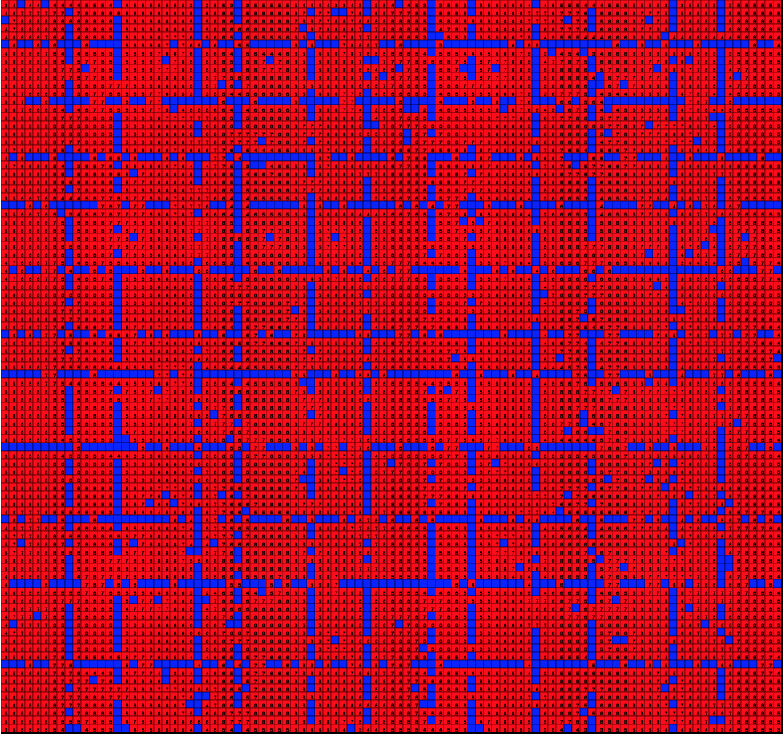
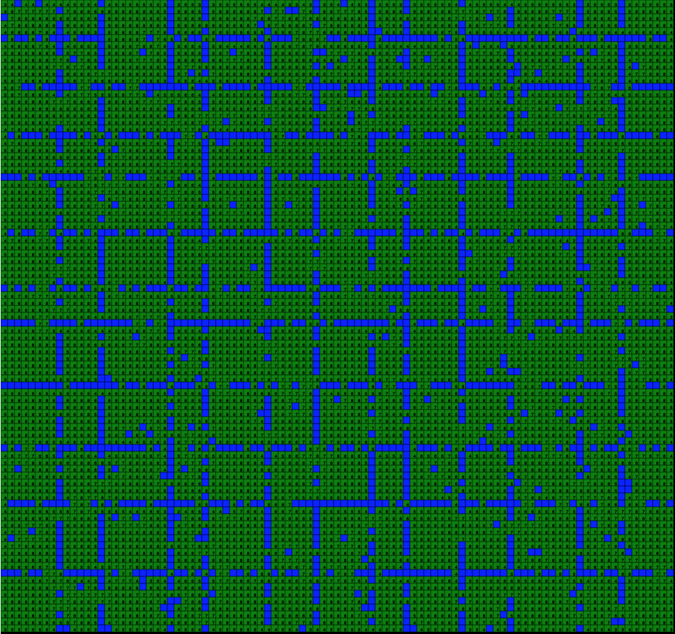
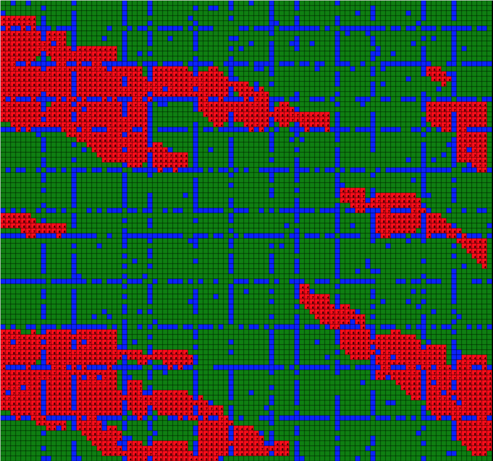

# Cell Culture Challenge

<h3 align="center">Cell Culture Challenge, 6-16-2021</h3>
<h4 align="center"> By Harrison Strand</h4>

## Description

This project was designed as a visual and interactive cell culture grid to demonstrate certain growth patterns within a grid format. User's can enter their culture cell data into a specific layout and use key presses to imitate hourly change between livable cells, blossomed cells, and uninhabitable cells. This project was created using JavaScript, TypeScript, and p5.js library within an Angular component framework.

 

## User Stories

  
Expand

| ID   | User Story                                                                                | Accepted |
| ---- | ----------------------------------------------------------------------------------------- | -------- |
| US01 | "As a user, I want to be able to see a color coded grid of all different stages of cells"         | True     |
| US02 | "As a user, I want to be able to see a display of neighboring cells and their count in relation to each other cell"         | True     |
| US03 | "As a user, I want to be able to see the initial round of cells as livable spaces and unlivable spaces in the grid"         | True     |
| US04 | "As a user, I want to be able to press a key to display the second round of cells as a fully blossomed state" | True     |
| US05 | "As a user, I want to be able to progress to the next round with a key press to show the final form of a stable grid of blossomed and unblossomed cells"           | True     |

 
 

### MVP

User has the ability to navigate through each round of cell progression to a final stable round of cells.
 
 

### Tools/Frameworks/Resources

- Angular
- TypeScript
- p5.js Library
- JavaScript
 
 

### Stretch Goals

- Sidebar display of blossomed to livable cell ratio as percentage
- Sidebar display of number of round iterations progressed
- Sidebar display of total number of blossomed cells
 
 

### Navigation

- To navigate through rounds, click on the grid and press `2` for round two and `3` for round three. 

### Visual Examples

 

Round 1 - Initial state of livable cells and unlivable cells before cell growth

 
 

Round 2 - State of blossomed cells and unlivable cells before the implimentation of overcrowding

 
 

Round 3 - Final state of blossomed cells, livable cells that have died out from overcrowding, and unlivable cells as a stable cell grid system for growth

 
 

## Setup/Installation Requirements

##### Software Requirements

1. Internet browser
2. A code editor such as VSCode to view and edit the code

##### Open Locally

- Click on the link to my repository: [My Repository](https://github.com/HarrisonStrand/cell-culture-challenge)
- Click on the green "Code" button and copy the repository URL
- Open your terminal and use the command `git clone ` into the directory you would like to clone the repository
- Open in text editor to view code and make changes

### Required Scripts

In the project directory, run:

### `npm install`

Installs all dependancies for the project in order to run the application

### `npm start`

Runs the app in the development mode.\
Open [http://localhost:4200](http://localhost:4200) to view it in the browser.
Navigate to [http://localhost:4200/arcade-page](http://localhost:4200/cell-culture)

The page will reload if you make edits.\
You will also see any lint errors in the console.

## Available Scripts

### `npm test`

Launches the test runner in the interactive watch mode.\
See the section about [running tests](https://facebook.github.io/create-react-app/docs/running-tests) for more information.

### `npm run build`

Builds the app for production to the `build` folder.\
It correctly bundles React in production mode and optimizes the build for the best performance.

The build is minified and the filenames include the hashes.\
Your app is ready to be deployed!

### `npm run eject`

**Note: this is a one-way operation. Once you `eject`, you can’t go back!**

If you aren’t satisfied with the build tool and configuration choices, you can `eject` at any time. This command will remove the single build dependency from your project.

Instead, it will copy all the configuration files and the transitive dependencies (webpack, Babel, ESLint, etc) right into your project so you have full control over them. All of the commands except `eject` will still work, but they will point to the copied scripts so you can tweak them. At this point you’re on your own.

You don’t have to ever use `eject`. The curated feature set is suitable for small and middle deployments, and you shouldn’t feel obligated to use this feature. However we understand that this tool wouldn’t be useful if you couldn’t customize it when you are ready for it.
 
 

## Learn More

  
Expand

This project was generated with [Angular CLI](https://github.com/angular/angular-cli) version 11.2.6.

## Development server

Run `ng serve` for a dev server. Navigate to `http://localhost:4200/`. The app will automatically reload if you change any of the source files.

## Code scaffolding

Run `ng generate component component-name` to generate a new component. You can also use `ng generate directive|pipe|service|class|guard|interface|enum|module`.

## Build

Run `ng build` to build the project. The build artifacts will be stored in the `dist/` directory. Use the `--prod` flag for a production build.

## Running unit tests

Run `ng test` to execute the unit tests via [Karma](https://karma-runner.github.io).

## Running end-to-end tests

Run `ng e2e` to execute the end-to-end tests via [Protractor](http://www.protractortest.org/).

## Further help

To get more help on the Angular CLI use `ng help` or go check out the [Angular CLI Overview and Command Reference](https://angular.io/cli) page.

## Known Bugs

- Program main function does not count the number of round iterations before progressing to the final round

## Support and Contact Details

If any further errors or bugs occur with installation, please email us at, <harrisonstrand@gmail.com>

## Technologies Used

- VSCode
- Node
- Angular
- Typescript
- Javascript
- p5.js

### License

This software is licensed under the [MIT License](https://choosealicense.com/licenses/mit/).

Copyright (c) 2021 Harrison Strand
